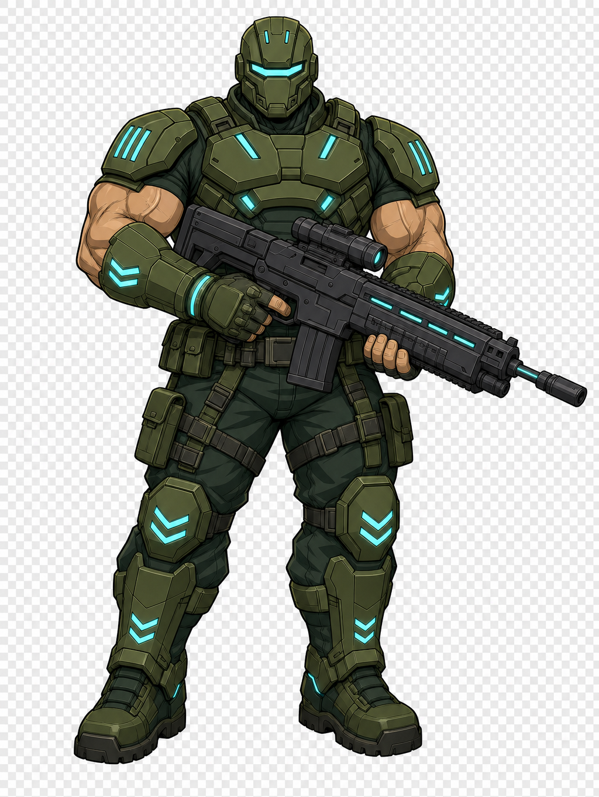

<div align="center">



# ⚡ WARDEN ZERO ⚡

### Hold the line. Collect the gems. Level up. Crush the horde.

A fast, chaotic **top-down arena survival shooter** that runs right in your browser.


</div>

---

## 🎮 The game

Survive **8 escalating waves** of relentless hordes across a big, camera-following arena — then face the **Warden Colossus** boss. Every kill drops a **gem**; scoop them up to **level up mid-fight** and pick your upgrades. Go loud, stay moving, build your run.

> 🟢 Pure chaos. Shoot, dash, bomb, collect, repeat. 🟢

## ✨ Features

- 🌊 **8 waves + boss finale** — up to **~80 enemies** on screen at once
- 🧟 **8 enemy types** — grunt, swarmer, runner, brute, tank, plus pixel skeleton, spider & demon
- 💎 **Gems = XP** — collect (with magnet + end-of-wave vacuum) to **level up** and choose **1 of 3 upgrades**
- 🔧 **16 upgrades** — multishot, crit, piercing, lifesteal, regen, gem magnet, bomb mods… real build variety
- 💥 **Abilities** — dash (with i-frames) and a radial bomb, on cooldowns
- 🩸 **Boss fight** — the Warden Colossus, with a health bar and minion summons
- 🔊 Sound, screen shake, particles, hearts & coins

## 🕹️ Controls

| Input | Action |
| :---: | :--- |
| `W` `A` `S` `D` | Move |
| 🖱️ Mouse | Aim |
| 🖱️ Left click | Shoot |
| `Space` | Dash |
| `E` | Bomb |
| `Esc` | Pause |
| `1` `2` `3` | Pick upgrade on level-up |

## 🛠️ Tech stack

[Phaser 3](https://phaser.io/) (Arcade Physics + WebGL) · **TypeScript** (strict) · [Vite](https://vitejs.dev/) · high-DPI rendering.

## 🚀 Getting started

```bash
npm install
npm run dev      # ▶  http://localhost:5173
```

| Script | Does |
| :--- | :--- |
| `npm run dev` | Dev server with hot reload |
| `npm run build` | Type-check + production build → `dist/` |
| `npm run preview` | Serve the production build |
| `npm run check` | Type-check only |

Requires **Node.js 20+**.

## ☁️ Deployment

It's a fully static site (`dist/`) — host it anywhere.

- **Vercel** — preset `Vite`, build `npm run build`, output `dist`
- **Netlify** — build `npm run build`, publish `dist`

## 📁 Project structure

```
src/
  main.ts          # Phaser bootstrap + scene list
  config/          # constants, palette, player stats, enemies, waves, upgrades
  scenes/          # Boot · Preload · MainMenu · Game · Upgrade · Pause · GameOver · Victory
  entities/        # Player · Bullet · Enemy · Pickup · Gem
  systems/         # Weapon · EnemySpawn · Wave · Upgrade · Effects · Sound
  ui/              # Hud · Button · Panel · UpgradeCard
public/assets/     # sprites + audio
```

## 🎨 Credits

All gameplay assets are **CC0 / public domain** — credit given gladly:

- 🧟 **Enemies & monsters** — [Kenney](https://kenney.nl) *Toon Characters* & *Tiny Dungeon*
- 🔊 **Sound effects** — [Kenney](https://kenney.nl) *Sci-Fi / Interface / Impact Sounds*
- 🎖️ **Warden character art** — generated by the author with [Recraft](https://recraft.ai)

## 📜 License

Code: **[MIT](LICENSE)** © Raj Gurung — assets CC0 as noted above.

## 🤝 Contributing

Issues & PRs welcome! Run `npm run check` and `npm run build` before submitting, and match the surrounding code style.

<div align="center">

—

**Built with 🟢 + 🔵 by [Raj Gurung](https://github.com/rajgurung)**

⭐ Star it if you had fun shooting things.

</div>
