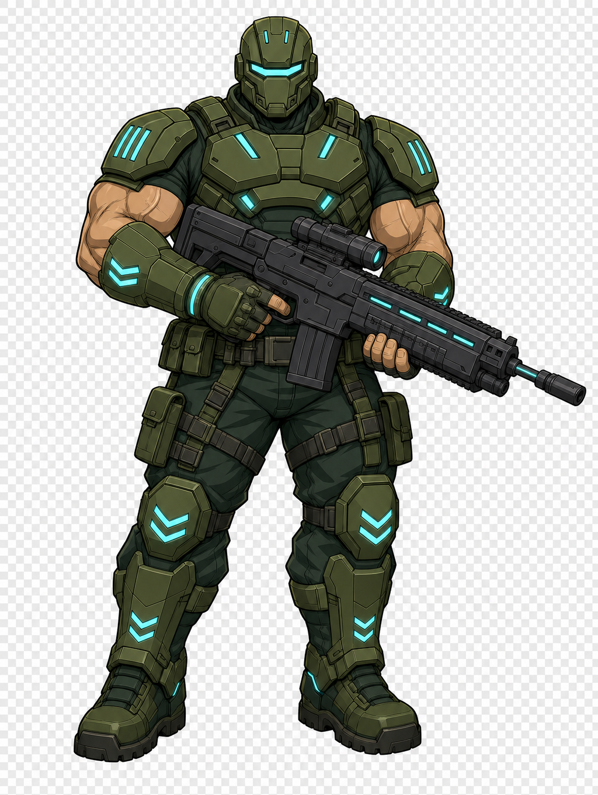

<div align="center">



# ⚡ WARDEN ZERO ⚡

### Hold the line. Collect the gems. Level up. Crush the horde.

A fast, chaotic **top-down arena survival shooter** that runs right in your browser.

> **v3: built with Unity 6.** A rigged 3D Warden that turns a full 360° with his rifle, bloom and glow, both game modes, and touch controls. The earlier Babylon.js version is tagged `babylon-final`.


</div>

---

## 🎮 The game

Two modes, one Warden:

- 🏟️ **Arena** — survive **8 escalating waves** of relentless hordes across a big, camera-following arena, then face the **Warden Colossus** boss. Every kill drops a **gem**; scoop them up to **level up mid-fight** and pick your upgrades.
- 🌴 **Operation Greenfang** — a 2.5D **jungle assault**. Push through the foliage and clear the sector, calling in **artillery** and **air strikes** (paint a target, brace, watch the treeline erupt).

> 🟢 Pure chaos. Shoot, dash, bomb, collect, repeat. 🟢

## ✨ Features

- 🌊 **8 waves + boss finale** — up to **~80 enemies** on screen at once
- 🧟 **11 enemy types** — grunt, swarmer, runner, brute, tank, spitter, warlord, the Colossus, plus pixel skeleton, spider & demon
- 💎 **Gems = XP** — collect (with magnet + end-of-wave vacuum) to **level up** and choose **1 of 3 upgrades**
- 🔧 **16 upgrades** — multishot, crit, piercing, lifesteal, regen, gem magnet, bomb mods… real build variety
- 💥 **Abilities** — dash (with i-frames) and a radial bomb, on cooldowns
- 🩸 **Boss fight** — the Warden Colossus, with a health bar and minion summons
- 🌴 **Second mode (Greenfang)** — 2.5D jungle with depth-sorted canopies + **call-in artillery & air strikes** (Q to switch, right-click to call)
- 🔊 Sound, screen shake, particles, hearts & coins

## 🕹️ Controls

| Input | Action |
| :---: | :--- |
| `W` `A` `S` `D` | Move |
| 🖱️ Mouse | Aim |
| 🖱️ Left click | Shoot |
| `Space` | Dash |
| 🖱️ Right click | Bomb (arena) · call strike (Greenfang) |
| `Q` | Switch armed strike (Greenfang) |
| `Esc` | Pause |
| `1` `2` `3` | Pick upgrade on level-up |

## 🛠️ Tech stack

[Unity](https://unity.com/) 6.3 LTS with the Universal Render Pipeline, built for WebGL. C# gameplay code, bloom and ACES tone mapping, a Humanoid-rigged 3D Warden (generated with [Tripo](https://www.tripo3d.ai)) with hand IK on the rifle.

Gameplay numbers were ported from the original configs (enemies, waves, upgrades, player stats). See `unity/PLAN.md` for the feature checklist.

## 🚀 Getting started

Install Unity Hub and Unity 6.3 LTS (6000.3.26f1) with WebGL Build Support, then open the `unity/` folder in Unity Hub. Build, test and scene-generation commands are in [`unity/README.md`](unity/README.md).

Model, texture and sound files under `unity/` are stored with Git LFS. Run `git lfs install` once before cloning.

## ☁️ Deployment

Vercel serves the prebuilt WebGL game from `web/` with no build step (`vercel.json`). To publish a new version:

```bash
scripts/publish-web.sh   # builds Unity WebGL and copies it to web/
```

Commit `web/`, open a PR (Vercel posts a preview link), and merge to main to go live.

## 📁 Project structure

```
unity/               # the Unity project (Assets, Packages, ProjectSettings)
  Assets/Scripts/    # gameplay: player, enemies, waves, upgrades, Greenfang mission
  Assets/Editor/     # scene builder, WebGL builder, import settings
  Assets/Tests/      # EditMode and PlayMode tests
web/                 # published WebGL build served by Vercel
scripts/             # publish-web.sh
docs/                # artwork
```

Debug URL parameters: `?boss` jumps to the Warden Colossus, `?wave=N` starts at wave N, `?phase=warlord` jumps to a Greenfang phase.

## 🎨 Credits

All gameplay assets are **CC0 / public domain** — credit given gladly:

- 🧟 **Enemies & monsters** — [Kenney](https://kenney.nl) *Toon Characters* & *Tiny Dungeon*
- 🔊 **Sound effects** — [Kenney](https://kenney.nl) *Sci-Fi / Interface / Impact Sounds*
- 🎖️ **Warden character art** — generated by the author with [Recraft](https://recraft.ai)
- 🧍 **3D Warden model, rig and animations** — generated from that art with [Tripo](https://www.tripo3d.ai)

## 📜 License

Code: **[MIT](LICENSE)** © Raj Gurung — assets CC0 as noted above.

## 🤝 Contributing

Issues & PRs welcome! Run the EditMode and PlayMode tests (see `unity/README.md`) before submitting, and match the surrounding code style.

<div align="center">

—

**Built with 🟢 + 🔵 by [Raj Gurung](https://github.com/rajgurung)**

⭐ Star it if you had fun shooting things.

</div>
